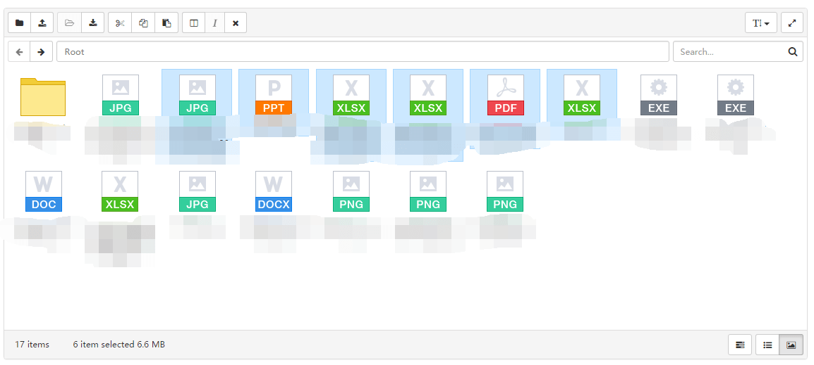

# docmana

docmana 是一个 js 库，用于创建可扩展的web端的文件管理器

## 为什么使用它？

* UI 简单直接，布局仿 Windows File Explorer，支持快捷键
* 样式基于 Bootstrap，也可重写所有模板基于其他样式库
* 模块化，预留扩展点，定制或扩展方便
* 与后端主要交互接口兼容 [elFinder](https://github.com/Studio-42/elFinder)，服务器端可重用现有的 elFinder Connector（需稍作更改）

## 当前版本特性

* 文件（夹）的基本管理（上传、重命名、删除、下载文件、新建文件夹）
* 文件浏览（列表、大图标视图）
* 文件预览（预览类型取决去服务器端具体实现）
* 文件夹内搜索（根据文件名查找）

## 依赖

* [jQuery](https://github.com/jquery/jquery)（>= 1.11.x）
* [Bootstrap](https://github.com/twbs/bootstrap)（= 3.x）
* [Lodash](https://github.com/lodash/lodash) （>= 4.x）
* [Backbone](https://github.com/jashkenas/backbone)（或 veronica）
* [FontAwesome](https://github.com/FortAwesome/Font-Awesome)

## 示例



[Demo](http://gochant.github.io/docmana)

上面的例子仅仅就是看看，没有后台不能用，自己部署就需要写一个或者找一个 elFinder 现成的


## 开始使用

### 1. 引入 JS/CSS

```
<!-- css -->
<link href="assets/font-awesome/css/font-awesome.min.css" rel="stylesheet" />
<link href="assets/bootstrap/css/bootstrap.min.css" rel="stylesheet" />
<link href="../dist/css/docmana.css" rel="stylesheet" />

<!-- js -->
<script src="assets/jquery.min.js"></script>
<script src="assets/lodash.min.js"></script>
<script src="assets/bootstrap.min.js"></script>
<script src="assets/backbone.min.js"></script>
<script src="../dist/js/docmana.js"></script>
```

### 2. 放置目标元素

默认配置下，docmana 主界面采用绝对定位布局以撑满整个父级元素，因此父级元素应该设置一个高度

```
<div id="docmana"></div>
```

### 3. 调用

```
$(function () {
    $('#docmana').docmana({
        store: {
            requestData: {
                folder: 'Medias'
            },
            url: '/FileManager/Medias'
        }
    });
});
```

## API

暂时没有刻意暴露接口，但因为是模块化和事件驱动开发，还是可以比较简便的实现一些常用功能

举个例子：

**获取选中文件**

```
var instance = $('#docmana').data('docmana');
instance.workzone().on('selected', function (selected) {
    var data = instance.store().byIds(instance.workzone().getIds());
    console.log(data);
})
```

### 构建

使用 [gulp](https://github.com/gulpjs/gulp)，nodejs 环境（4.x）

```
gulp

gulp scripts
gulp images
gulp less
```

## 当前版本一些问题和说明

### 快捷键

* `Ctrl+C`、`Ctrl+X`、`Ctrl+V` 剪贴板相关操作
* 预览模式和图标模式下，`Left`、`Right` 预览（选中）上一条、下一条
* 列表模式下，`Up`、`Down` 选中上一条、下一条
* `Alt+Left`、`Alt+Right` 后退、前进
* `F2` 重命名
* `Del` 删除
* `Alt+N` 新建文件夹
* `Return` 打开（查看）文件（夹） 
* `Esc` 关闭对话框

### 浏览器兼容性

在 Chrome 50 和 IE11 下进行了测试

### 一些说明

* **bug** 重命名后选择的文件可能会发生不一致
* **待改进** 在不同文件夹间拷贝时，并未判断文件的重复
* **待改进** 未建立缓冲区进行懒加载，大量文件可能会造成界面卡顿
* **待改进** 长时操作没有等待状态
* **待改进** 图标视图下，使用方向键在工作区进行导航时，不支持上下方向
* **待改进** 新建文件夹，由于冲突，并未采用 Windows 快捷键：Ctrl+Alt+N，而是 Alt+N
* **待改进** 不支持右键菜单

* 可以自定义样式，不依赖 FontAwesome 的图标
* Backbone 用了它的 View，可以自己实现一个，那么可不用 Backbone
* 最终打包的版本包含了 jquery-ui 的定制版（用于实现拖拽选择）、jquery form（用于 ajax 提交文件时的兼容性）等，因此
有点大，后续会考虑提供轻量级版本，或自己更改 gulp 配置 